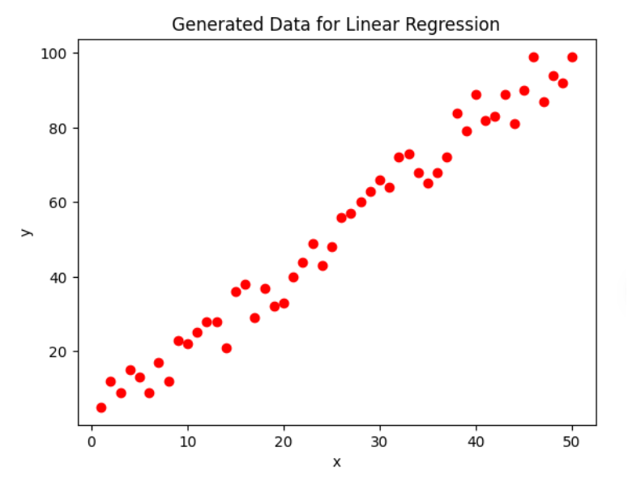
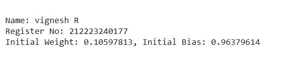
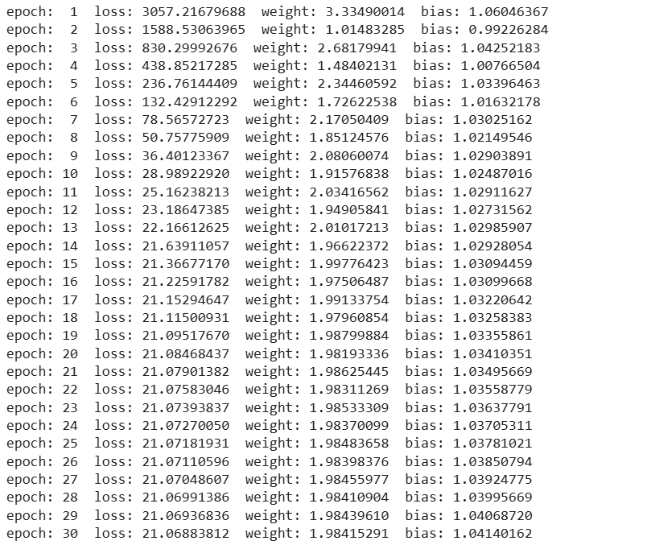
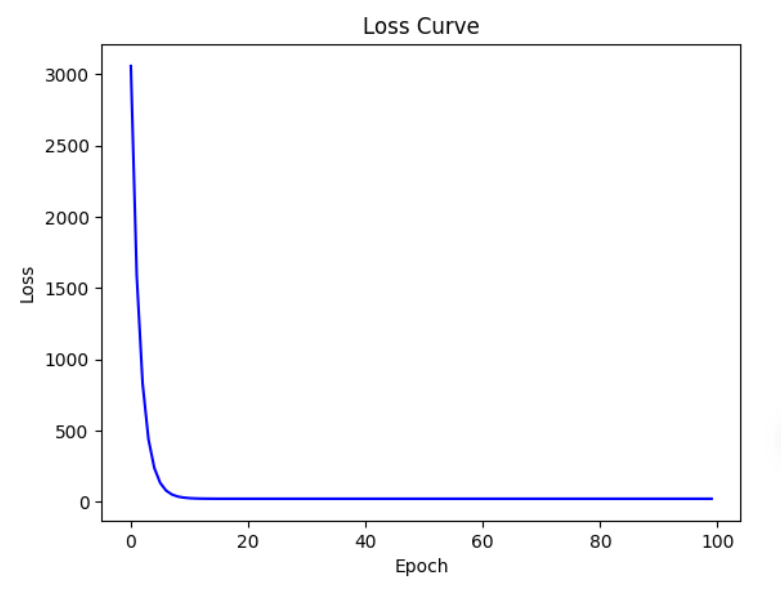
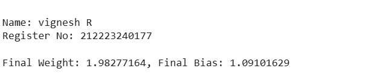
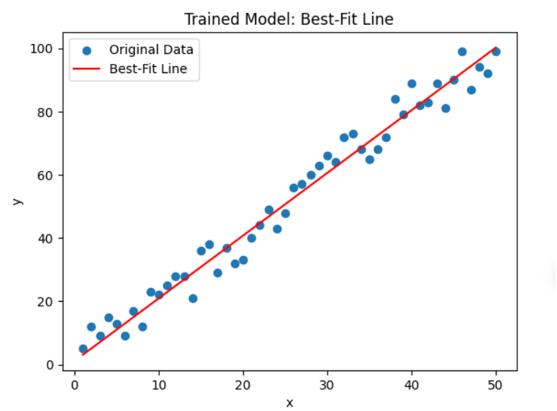
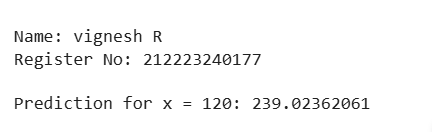

# Developing a Neural Network Regression Model

## AIM
To develop a neural network regression model for the given dataset.

## THEORY
Regression problems involve predicting a continuous output variable based on input features. Traditional linear regression models often struggle with complex patterns in data. Neural networks, specifically feedforward neural networks, can capture these complex relationships by using multiple layers of neurons and activation functions. In this experiment, a neural network model is introduced with a single linear layer that learns the parameters weight and bias using gradient descent.

## Neural Network Model
Include the neural network model diagram.

## DESIGN STEPS
### STEP 1: Generate Dataset
Create input values  from 1 to 50 and add random noise to introduce variations in output values .

### STEP 2: Initialize the Neural Network Model
Define a simple linear regression model using torch.nn.Linear() and initialize weights and bias values randomly.

### STEP 3: Define Loss Function and Optimizer
Use Mean Squared Error (MSE) as the loss function and optimize using Stochastic Gradient Descent (SGD) with a learning rate of 0.001.

### STEP 4: Train the Model
Run the training process for 100 epochs, compute loss, update weights and bias using backpropagation.

### STEP 5: Plot the Loss Curve
Track the loss function values across epochs to visualize convergence.

### STEP 6: Visualize the Best-Fit Line
Plot the original dataset along with the learned linear model.

### STEP 7: Make Predictions
Use the trained model to predict  for a new input value .

## PROGRAM
#### Name: vignesh R
#### Register Number: 212223240177

```py
import torch
import torch.nn as nn  # Neural network module
import matplotlib.pyplot as plt  # For plotting
```

```py
#  Generate Input Data (X) and Output Data (y)
torch.manual_seed(71)  # For reproducibility
X=torch.linspace(1,50,50).reshape(-1,1)
e=torch.randint(-8,9,(50,1),dtype=torch.float)
y=2*X+1+e

```
```py
# Plot the original data
plt.scatter(X, y, color='red')
plt.xlabel('x')
plt.ylabel('y')
plt.title('Generated Data for Linear Regression')
plt.show()
```

```py
# Define the Linear Model Class
class Model(nn.Module):
    def __init__(self, in_features, out_features):
        super().__init__()
        self.linear=nn.Linear(in_features,out_features)

    def forward(self, x):
        return self.linear(x)
```

```py
# Initialize the Model
torch.manual_seed(59)  # Ensure same initial weights
model = Model(1, 1)
```

```py
# Print Initial Weights and Bias
initial_weight = model.linear.weight.item()
initial_bias = model.linear.bias.item()
print("\nName: vignesh R")
print("Register No: 212223240177")
print(f'Initial Weight: {initial_weight:.8f}, Initial Bias: {initial_bias:.8f}\n')
```


```py
# Define Loss Function & Optimizer
loss_function=nn.MSELoss()
optimizer=torch.optim.SGD(model.parameters(),lr=0.001)
```

```py
# Train the Model
epochs = 100
losses = []

for epoch in range(1, epochs + 1):  # Loop over epochs
    optimizer.zero_grad()
    y_pred=model(X)
    loss=loss_function(y_pred,y)
    losses.append(loss.item())
    loss.backward()
    optimizer.step()

    # Print loss, weight, and bias for EVERY epoch
    print(f'epoch: {epoch:2}  loss: {loss.item():10.8f}  '
          f'weight: {model.linear.weight.item():10.8f}  '
          f'bias: {model.linear.bias.item():10.8f}')
```

```py
# Plot Loss Curve
plt.plot(range(epochs), losses, color='blue')
plt.ylabel('Loss')
plt.xlabel('Epoch')
plt.title('Loss Curve')
plt.show()
```


```py
# Final Weights & Bias
final_weight = model.linear.weight.item()
final_bias = model.linear.bias.item()
print("\nName: vignesh R")
print("Register No: 212223240177")
print(f'\nFinal Weight: {final_weight:.8f}, Final Bias: {final_bias:.8f}')
```

```py
#  Best-Fit Line Calculation
x1 = torch.tensor([X.min().item(), X.max().item()]) # Find min and max values of X
y1 = x1 * final_weight + final_bias # Compute corresponding y-values using trained model
```

```py
# Plot Original Data & Best-Fit Line
plt.scatter(X, y, label="Original Data")
plt.plot(x1, y1, 'r', label="Best-Fit Line")
plt.xlabel('x')
plt.ylabel('y')
plt.title('Trained Model: Best-Fit Line')
plt.legend()
plt.show()
```

```py
# Prediction for x = 120
x_new = torch.tensor([[120.0]])  # New input as a tensor
y_new_pred = model(x_new).item()  # Predict using trained model
print("\nName: vignesh R")
print("Register No: 212223240177")
print(f"\nPrediction for x = 120: {y_new_pred:.8f}")
```



## RESULT
Thus, a neural network regression model was successfully developed and trained using PyTorch.
